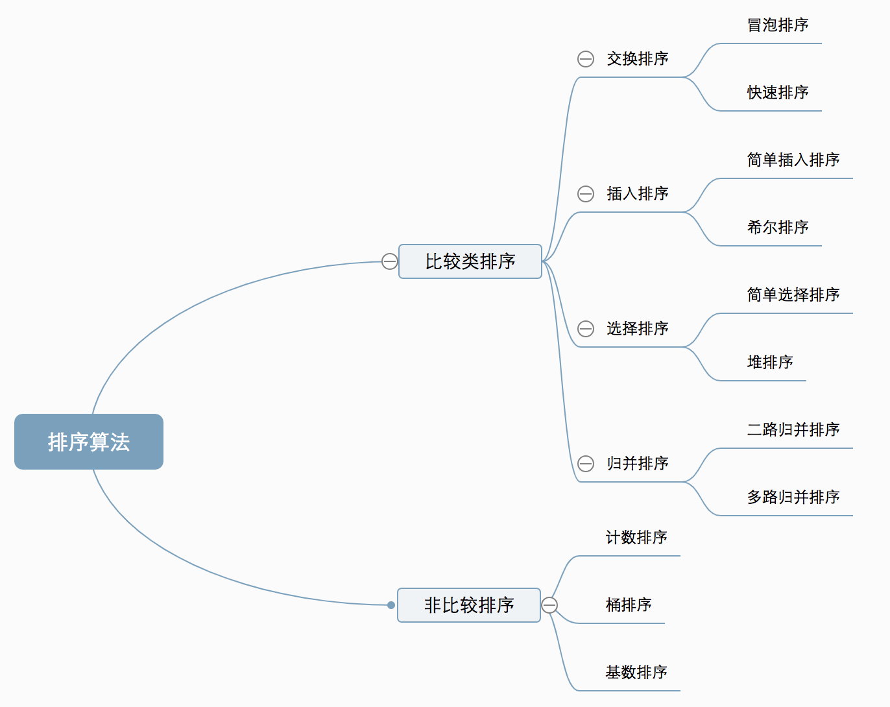
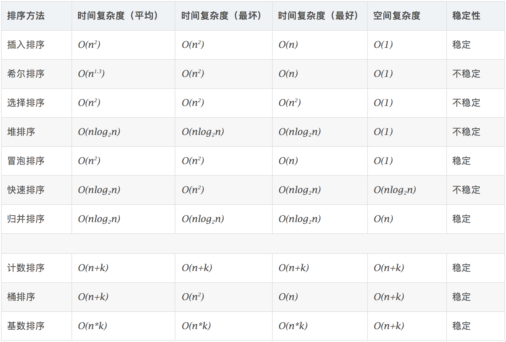

## 排序
分类

复杂度

概念
- 稳定：如果a原本在b前面，而a=b，排序之后a仍然在b的前面。
- 不稳定：如果a原本在b的前面，而a=b，排序之后 a 可能会出现在 b 的后面。
- 时间复杂度：对排序数据的总的操作次数。反映当n变化时，操作次数呈现什么规律。
- 空间复杂度：是指算法在计算机内执行时所需存储空间的度量，它也是数据规模n的函数。
### 快速排序
快速排序的基本思想：通过一趟排序将待排记录分隔成独立的两部分，其中一部分记录的关键字均比另一部分的关键字小，则可分别对这两部分记录继续进行排序，以达到整个序列有序。
快速排序使用分治法来把一个串（list）分为两个子串（sub-lists）。具体算法描述如下：
- 从数列中挑出一个元素，称为 “基准”（pivot）；
- 重新排序数列，所有元素比基准值小的摆放在基准前面，所有元素比基准值大的摆在基准的后面（相同的数可以到任一边）。在这个分区退出之后，该基准就处于数列的中间位置。这个称为分区（partition）操作；
- 递归地（recursive）把小于基准值元素的子数列和大于基准值元素的子数列排序。
```
// Java program for implementation of QuickSort
class QuickSort {
    /* This function takes last element as pivot,
    places the pivot element at its correct
    position in sorted array, and places all
    smaller (smaller than pivot) to left of
    pivot and all greater elements to right
    of pivot */
    int partition(int arr[], int low, int high) {
        int pivot = arr[high];
        int i = (low - 1); // index of smaller element
        for (int j = low; j < high; j++) {
            // If current element is smaller than or
            // equal to pivot
            if (arr[j] <= pivot) {
                i++;
                // swap arr[i] and arr[j]
                int temp = arr[i];
                arr[i] = arr[j];
                arr[j] = temp;
            }
        }
        // swap arr[i+1] and arr[high] (or pivot)
        int temp = arr[i + 1];
        arr[i + 1] = arr[high];
        arr[high] = temp;
        return i + 1;
    }
    /* The main function that implements QuickSort()
    arr[] --> Array to be sorted,
    low --> Starting index,
    high --> Ending index */
    void sort(int arr[], int low, int high) {
        if (low < high) {
            /* pi is partitioning index, arr[pi] is
            now at right place */
            int pi = partition(arr, low, high);
            // Recursively sort elements before
            // partition and after partition
            sort(arr, low, pi - 1);
            sort(arr, pi + 1, high);
        }
    }
    /* A utility function to print array of size n */
    static void printArray(int arr[]) {
        int n = arr.length;
        for (int i = 0; i < n; ++i)
            System.out.print(arr[i] + " ");
        System.out.println();
    }
    // Driver program
    public static void main(String args[]) {
        int arr[] = { 10, 7, 8, 9, 1, 5 };
        int n = arr.length;
        QuickSort ob = new QuickSort();
        ob.sort(arr, 0, n - 1);
        System.out.println("sorted array");
        printArray(arr);
    }
}
```
### 冒泡排序 Bubble Sort
- 比较相邻的元素。如果第一个比第二个大，就交换它们两个；
- 对每一对相邻元素作同样的工作，从开始第一对到结尾的最后一对，这样在最后的元素应该会是最大的数；
- 针对所有的元素重复以上的步骤，除了最后一个；
- 重复步骤1~3，直到排序完成。
```
// java program for implementation of Bubble Sort
class BubbleSort {
    void bubbleSort(int arr[]) {
        int n = arr.length;
        for (int i = 0; i < n-1; i++)
            for (int j = 0; j < n-i-1; j++)
                if (arr[j] > arr[j+1]) {
                    // swap arr[j+1] and arr[j]
                    int temp = arr[j];
                    arr[j] = arr[j+1];
                    arr[j+1] = temp;
                }
    }
    // printArray
    void printArray(int arr[]) {
        int n = arr.length;
        for (int i = 0; i < n; ++i)
            System.out.print(arr[i] + " ");
        System.out.println();
    }
    // Driver method to test above
    public static void main(String args[]) {
        BubbleSort ob = new BubbleSort();
        int arr[] = {64, 34, 25, 12, 22, 11, 90};
        ob.bubbleSort(arr);
        System.out.println("Sorted array");
        ob.printArray(arr);
    }
}
```
### 选择排序 Selection Sort
原理：首先在未排序序列中找到最小（大）元素，存放到排序序列的起始位置，然后，再从剩余未排序元素中继续寻找最小（大）元素，然后放到已排序序列的末尾。以此类推，直到所有元素均排序完毕。
n个记录的直接选择排序可经过n-1趟直接选择排序得到有序结果。
具体算法描述如下：
- 初始状态：无序区为R[1..n]，有序区为空；
- 第i趟排序(i=1,2,3…n-1)开始时，当前有序区和无序区分别为R[1..i-1]和R(i..n）。该趟排序从当前无序区中-选出关键字最小的记录 R[k]，将它与无序区的第1个记录R交换，使R[1..i]和R[i+1..n)分别变为记录个数增加1个的新有序区和记录个数减少1个的新无序区；
- n-1趟结束，数组有序化了。
```
// java program for implementation of Selection Sort
class SelectionSort {
    void sort(int arr[]) {
        int n = arr.length;
        // One by one move boundary of unsorted subarray
        for (int i = 0; i < n-1; i++) {
            // Find the minimum element in unsorted array
            int min_idx = i;
            for (int j = i+1; j < n; j++)
                if (arr[j] < arr[min_idx])
                    min_idx = j;
            // Swap the found minimum element with the first
            // element
            int temp = arr[min_idx];
            arr[min_idx] = arr[i];
            arr[i] = temp;
        }
    }
    // Prints the array
    void printArray(int arr[]) {
        int n = arr.length;
        for (int i = 0; i < n; ++i)
            System.out.print(arr[i] + " ");
        System.out.println();
    }
    // Driver code to test above
    public static void main(String args[]) {
        SelectionSort ob = new SelectionSort();
        int arr[] = {64,25,12,22,11};
        ob.sort(arr);
        System.out.println("Sorted array");
        ob.printArray(arr);
    }
}
```
### 插入排序 Insertion Sort
算法描述
一般来说，插入排序都采用in-place在数组上实现。具体算法描述如下：
- 从第一个元素开始，该元素可以认为已经被排序；
- 取出下一个元素，在已经排序的元素序列中从后向前扫描；
- 如果该元素（已排序）大于新元素，将该元素移到下一位置；
- 重复步骤3，直到找到已排序的元素小于或者等于新元素的位置；
- 将新元素插入到该位置后；
- 重复步骤2~5。
``` 
// java program for implementation of Insertion Sort
class InsertionSort {
    /*Function to sort array using insertion sort*/
    void sort(int arr[]) {
        int n = arr.length;
        for (int i = 1; i < n; ++i) {
            int key = arr[i];
            int j = i - 1;
            /* Move elements of arr[0..i-1], that are
            greater than key, to one position ahead
            of their current position */
            while (j >= 0 && arr[j] > key) {
                arr[j + 1] = arr[j];
                j = j - 1;
            }
            arr[j + 1] = key;
        }
    }
    // A utility function to print array of size n
    static void printArray(int arr[]) {
        int n = arr.length;
        for (int i = 0; i < n; ++i)
            System.out.print(arr[i] + " ");
        System.out.println();
    }
    // Driver method
    public static void main(String args[]) {
        int arr[] = { 12, 11, 13, 5, 6 };
        InsertionSort ob = new InsertionSort();
        ob.sort(arr);
        printArray(arr);
    }
}
```
### 希尔排序
1959年Shell发明，第一个突破O(n2)的排序算法，是简单插入排序的改进版。它与插入排序的不同之处在于，它会优先比较距离较远的元素。希尔排序又叫缩小增量排序。
4.1 算法描述
先将整个待排序的记录序列分割成为若干子序列分别进行直接插入排序，具体算法描述：
- 选择一个增量序列t1，t2，…，tk，其中ti>tj，tk=1；
- 按增量序列个数k，对序列进行k 趟排序；
- 每趟排序，根据对应的增量ti，将待排序列分割成若干长度为m 的子序列，分别对各子表进行直接插入排序。仅增量因子为1 时，整个序列作为一个表来处理，表长度即为整个序列的长度。
```
// Java implementation of ShellSort
class ShellSort {
    /* An utility function to print array of size n*/
    static void printArray(int arr[]) {
        int n = arr.length;
        for (int i = 0; i < n; ++i)
            System.out.print(arr[i] + " ");
        System.out.println();
    }
    /* function to sort arr using shellSort */
    int sort(int arr[]) {
        int n = arr.length;
        // Start with a big gap, then reduce the gap
        for (int gap = n / 2; gap > 0; gap /= 2) {
            // Do a gapped insertion sort for this gap size.
            // The first gap elements a[0..gap-1] are already
            // in gapped order keep adding one more element
            // until the entire array is gap sorted
            for (int i = gap; i < n; i += 1) {
                // add a[i] to the elements that have been gap
                // sorted save a[i] in temp and make a hole at
                // position i
                int temp = arr[i];
                // shift earlier gap-sorted elements up until
                // the correct location for a[i] is found
                int j;
                for (j = i; j >= gap && arr[j - gap] > temp; j -= gap)
                    arr[j] = arr[j - gap];
                // put temp (the original a[i]) in its correct
                // location
                arr[j] = temp;
            }
        }
        return 0;
    }
    // Driver method
    public static void main(String args[]) {
        int arr[] = { 12, 34, 54, 2, 3 };
        System.out.println("Array before sorting");
        printArray(arr);
        ShellSort ob = new ShellSort();
        ob.sort(arr);
        System.out.println("Array after sorting");
        printArray(arr);
    }
}
```
### 归并排序
归并排序是建立在归并操作上的一种有效的排序算法。该算法是采用分治法（Divide and Conquer）的一个非常典型的应用。将已有序的子序列合并，得到完全有序的序列；即先使每个子序列有序，再使子序列段间有序。若将两个有序表合并成一个有序表，称为2-路归并。
算法描述:
- 把长度为n的输入序列分成两个长度为n/2的子序列；
- 对这两个子序列分别采用归并排序；
- 将两个排序好的子序列合并成一个最终的排序序列。
```
// Java program for implementation of MergeSort
class MergeSort {
    // Merges two subarrays of arr[].
    // First subarray is arr[l..m]
    // Second subarray is arr[m+1..r]
    void merge(int arr[], int l, int m, int r) {
        // Find sizes of two subarrays to be merged
        int n1 = m - l + 1;
        int n2 = r - m;
        /* Create temp arrays */
        int L[] = new int[n1];
        int R[] = new int[n2];
        /*Copy data to temp arrays*/
        for (int i = 0; i < n1; ++i)
            L[i] = arr[l + i];
        for (int j = 0; j < n2; ++j)
            R[j] = arr[m + 1 + j];
        /* Merge the temp arrays */
        // Initial indexes of first and second subarrays
        int i = 0, j = 0;
        // Initial index of merged subarry array
        int k = l;
        while (i < n1 && j < n2) {
            if (L[i] <= R[j]) {
                arr[k] = L[i];
                i++;
            }
            else {
                arr[k] = R[j];
                j++;
            }
            k++;
        }
        /* Copy remaining elements of L[] if any */
        while (i < n1) {
            arr[k] = L[i];
            i++;
            k++;
        }
        /* Copy remaining elements of R[] if any */
        while (j < n2) {
            arr[k] = R[j];
            j++;
            k++;
        }
    }
    // Main function that sorts arr[l..r] using
    // merge()
    void sort(int arr[], int l, int r) {
        if (l < r) {
            // Find the middle point
            int m = (l + r) / 2;
            // Sort first and second halves
            sort(arr, l, m);
            sort(arr, m + 1, r);
            // Merge the sorted halves
            merge(arr, l, m, r);
        }
    }
    /* A utility function to print array of size n */
    static void printArray(int arr[]) {
        int n = arr.length;
        for (int i = 0; i < n; ++i)
            System.out.print(arr[i] + " ");
        System.out.println();
    }
```
### 堆排序
堆排序（Heapsort）是指利用堆这种数据结构所设计的一种排序算法。堆积是一个近似完全二叉树的结构，并同时满足堆积的性质：即子结点的键值或索引总是小于（或者大于）它的父节点。
- 将初始待排序关键字序列(R1,R2….Rn)构建成大顶堆，此堆为初始的无序区；
- 将堆顶元素R[1]与最后一个元素R[n]交换，此时得到新的无序区(R1,R2,……Rn-1)和新的有序区(Rn),且满足R[1,2…n-1]<=R[n]；
- 由于交换后新的堆顶R[1]可能违反堆的性质，因此需要对当前无序区(R1,R2,……Rn-1)调整为新堆，然后再次将R[1]与无序区最后一个元素交换，得到新的无序区(R1,R2….Rn-2)和新的有序区(Rn-1,Rn)。不断重复此过程直到有序区的元素个数为n-1，则整个排序过程完成。
```
// Java program for implementation of Heap Sort
class HeapSort {
    public void sort(int arr[]) {
        int n = arr.length;
        // Build heap (rearrange array)
        for (int i = n / 2 - 1; i >= 0; i--)
            heapify(arr, n, i);
        // One by one extract an element from heap
        for (int i = n - 1; i >= 0; i--) {
            // Move current root to end
            int temp = arr[0];
            arr[0] = arr[i];
            arr[i] = temp;
            // call max heapify on the reduced heap
            heapify(arr, i, 0);
        }
    }
    // To heapify a subtree rooted with node i which is
    // an index in arr[]. n is size of heap
    void heapify(int arr[], int n, int i) {
        int largest = i; // Initialize largest as root
        int l = 2 * i + 1; // left = 2*i + 1
        int r = 2 * i + 2; // right = 2*i + 2
        // If left child is larger than root
        if (l < n && arr[l] > arr[largest])
            largest = l;
        // If right child is larger than largest so far
        if (r < n && arr[r] > arr[largest])
            largest = r;
        // If largest is not root
        if (largest != i) {
            int swap = arr[i];
            arr[i] = arr[largest];
            arr[largest] = swap;
            // Recursively heapify the affected sub-tree
            heapify(arr, n, largest);
        }
    }
    /* A utility function to print array of size n */
    static void printArray(int arr[]) {
        int n = arr.length;
        for (int i = 0; i < n; ++i)
            System.out.print(arr[i] + " ");
        System.out.println();
    }
    // Driver program
    public static void main(String args[]) {
        int arr[] = { 12, 11, 13, 5, 6, 7 };
        int n = arr.length;
        HeapSort ob = new HeapSort();
        ob.sort(arr);
        System.out.println("Sorted array is");
        printArray(arr);
    }
```
### 计数排序
计数排序不是基于比较的排序算法，其核心在于将输入的数据值转化为键存储在额外开辟的数组空间中。 作为一种线性时间复杂度的排序，计数排序要求输入的数据必须是有确定范围的整数。
算法描述
- 找出待排序的数组中最大和最小的元素；
- 统计数组中每个值为i的元素出现的次数，存入数组C的第i项；
- 对所有的计数累加（从C中的第一个元素开始，每一项和前一项相加）；
- 反向填充目标数组：将每个元素i放在新数组的第C(i)项，每放一个元素就将C(i)减去1。
```
// Java implementation of Counting Sort
class CountingSort {
    void sort(char arr[]) {
        int n = arr.length;
        // The output character array that will have sorted arr
        char output[] = new char[n];
        // Create a count array to store count of inidividul
        // characters and initialize count array as 0
        int count[] = new int[256];
        for (int i = 0; i < 256; ++i)
            count[i] = 0;
        // store count of each character
        for (int i = 0; i < n; ++i)
            ++count[arr[i]];
        // Change count[i] so that count[i] now contains actual
        // position of this character in output array
        for (int i = 1; i <= 255; ++i)
            count[i] += count[i - 1];
        // Build the output character array
        // To make it stable we are operating in reverse order.
        for (int i = n - 1; i >= 0; i--) {
            output[count[arr[i]] - 1] = arr[i];
            --count[arr[i]];
        }
        // Copy the output array to arr, so that arr now
        // contains sorted characters
        for (int i = 0; i < n; ++i)
            arr[i] = output[i];
    }
    // Driver method
    public static void main(String args[]) {
        CountingSort ob = new CountingSort();
        char arr[] = { 'g', 'e', 'e', 'k', 's', 'f', 'o',
                       'r', 'g', 'e', 'e', 'k', 's' };
        ob.sort(arr);
        System.out.print("Sorted character array is ");
        for (int i = 0; i < arr.length; ++i)
            System.out.print(arr[i]);
    }
}
```
### 桶排序
桶排序是计数排序的升级版。它利用了函数的映射关系，高效与否的关键就在于这个映射函数的确定。桶排序 (Bucket sort)的工作的原理：假设输入数据服从均匀分布，将数据分到有限数量的桶里，每个桶再分别排序（有可能再使用别的排序算法或是以递归方式继续使用桶排序进行排）。
算法描述:
- 设置一个定量的数组当作空桶；
- 遍历输入数据，并且把数据一个一个放到对应的桶里去；
- 对每个不是空的桶进行排序；
- 从不是空的桶里把排好序的数据拼接起来。
```
// Java program to sort an array using bucket sort
import java.util.*;
import java.util.Collections;
class GFG {
    // Function to sort arr[] of size n
    // using bucket sort
    static void bucketSort(float arr[], int n) {
        if (n <= 0)
            return;
        // 1) Create n empty buckets
        @SuppressWarnings("unchecked")
        Vector<Float>[] buckets = new Vector[n];
        for (int i = 0; i < n; i++) {
            buckets[i] = new Vector<Float>();
        }
        // 2) Put array elements in different buckets
        for (int i = 0; i < n; i++) {
            float idx = arr[i] * n;
            buckets[(int)idx].add(arr[i]);
        }
        // 3) Sort individual buckets
        for (int i = 0; i < n; i++) {
            Collections.sort(buckets[i]);
        }
        // 4) Concatenate all buckets into arr[]
        int index = 0;
        for (int i = 0; i < n; i++) {
            for (int j = 0; j < buckets[i].size(); j++) {
                arr[index++] = buckets[i].get(j);
            }
        }
    }
    // Driver code
    public static void main(String args[]) {
        float arr[] = { (float)0.897, (float)0.565,
                        (float)0.656, (float)0.1234,
                        (float)0.665, (float)0.3434 };
        int n = arr.length;
        bucketSort(arr, n);
        System.out.println("Sorted array is ");
        for (float el : arr) {
            System.out.print(el + " ");
        }
    }
}
```
桶排序最好情况下使用线性时间O(n)，桶排序的时间复杂度，取决与对各个桶之间数据进行排序的时间复杂度，因为其它部分的时间复杂度都为O(n)。很显然，桶划分的越小，各个桶之间的数据越少，排序所用的时间也会越少。但相应的空间消耗就会增大。
### 基数排序 Radix Sort
基数排序是按照低位先排序，然后收集；再按照高位排序，然后再收集；依次类推，直到最高位。有时候有些属性是有优先级顺序的，先按低优先级排序，再按高优先级排序。最后的次序就是高优先级高的在前，高优先级相同的低优先级高的在前。
算法描述:
- 取得数组中的最大数，并取得位数；
- arr为原始数组，从最低位开始取每个位组成radix数组；
- 对radix进行计数排序（利用计数排序适用于小范围数的特点）；
```
// Java implementation of Radix Sort
class RadixSort {
    // A utility function to get maximum value in arr[]
    static int getMax(int arr[], int n) {
        int mx = arr[0];
        for (int i = 1; i < n; i++)
            if (arr[i] > mx)
                mx = arr[i];
        return mx;
    }
    // A function to do counting sort of arr[] according to
    // the digit represented by exp.
    static void countSort(int arr[], int n, int exp) {
        int output[] = new int[n]; // output array
        int i;
        int count[] = new int[10];
        Arrays.fill(count, 0);
        // Store count of occurrences in count[]
        for (i = 0; i < n; i++)
            count[(arr[i] / exp) % 10]++;
        // Change count[i] so that count[i] now contains
        // actual position of this digit in output[]
        for (i = 1; i < 10; i++)
            count[i] += count[i - 1];
        // Build the output array
        for (i = n - 1; i >= 0; i--) {
            output[count[(arr[i] / exp) % 10] - 1] = arr[i];
            count[(arr[i] / exp) % 10]--;
        }
        // Copy the output array to arr[], so that arr[] now
        // contains sorted numbers according to current digit
        for (i = 0; i < n; i++)
            arr[i] = output[i];
    }
    // The main function to that sorts arr[] of size n using
    // Radix Sort
    static void radixsort(int arr[], int n) {
        // Find the maximum number to know number of digits
        int m = getMax(arr, n);
        // Do counting sort for every digit. Note that instead
        // of passing digit number, exp is passed. exp is 10^i
        // where i is current digit number
        for (int exp = 1; m / exp > 0; exp *= 10)
            countSort(arr, n, exp);
    }
    // A utility function to print an array
    static void print(int arr[], int n) {
        for (int i = 0; i < n; i++)
            System.out.print(arr[i] + " ");
    }
```
基数排序基于分别排序，分别收集，所以是稳定的。但基数排序的性能比桶排序要略差，每一次关键字的桶分配都需要O(n)的时间复杂度，而且分配之后得到新的关键字序列又需要O(n)的时间复杂度。假如待排数据可以分为d个关键字，则基数排序的时间复杂度将是O(d*2n) ，当然d要远远小于n，因此基本上还是线性级别的。
基数排序的空间复杂度为O(n+k)，其中k为桶的数量。一般来说n>>k，因此额外空间需要大概n个左右。
### 排序算法总结
